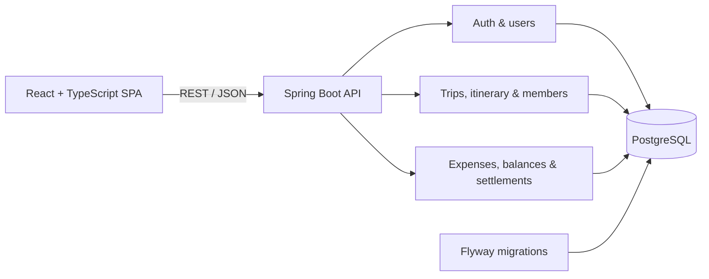

# SplitTrip

SplitTrip is a mobile-first group travel workspace for turning ideas into an itinerary and shared spending into clear, auditable balances. A travel group can collect activity suggestions, vote together, arrange the winning ideas on a visual timeline, split expenses in several ways, and record settlements without switching between multiple apps.

> Built as a portfolio project around production-minded full-stack engineering: secure authentication, explicit domain rules, database migrations, integration tests, query optimization, accessibility, and automated delivery checks.

## What it does

- Secure account registration, sign-in, rotating refresh sessions, and logout
- Trip creation, member invitations, roles, removal, and voluntary departure
- Unlimited activity ideas with one like or dislike per member
- A visual day planner with drag-and-drop scheduling, time ranges, overlaps, editing, and removal
- Expense creation and editing with equal, exact-amount, or percentage splits
- Per-member balances, simplified suggested repayments, settlement history, and reversible settlements
- Responsive English interface designed for both phones and desktop browsers

## Architecture



The backend is a **modular monolith**. Features share one deployable application and one PostgreSQL database while package boundaries keep authentication, user, trip, and common concerns separate. The production image serves the compiled React application and the API from the same origin.

See [Architecture](docs/architecture.md) and [Domain model](docs/domain-model.md) for the design in more detail.

## Technology

| Area | Technology |
| --- | --- |
| Backend | Java 21, Spring Boot, Spring Web, Spring Security, Spring Data JPA |
| Frontend | React, TypeScript, Vite, Tailwind CSS |
| Database | PostgreSQL, Flyway |
| API | REST, OpenAPI / Swagger UI |
| Testing | JUnit, Mockito, Testcontainers, Vitest, Testing Library |
| Delivery | Docker, GitHub Actions |

## Engineering highlights

- Access tokens are short-lived JWTs; refresh tokens are opaque, hashed in PostgreSQL, rotated on use, and stored in an `HttpOnly` cookie.
- Monetary values use decimal arithmetic and are validated against the trip currency and active membership.
- Balance calculation follows `paid - allocated share + settlements sent - settlements received`; a deterministic greedy pass produces a compact repayment plan.
- Repository queries load related records in batches to avoid N+1 behavior on trip workspaces.
- Flyway owns the schema and Hibernate validates it at startup.
- Integration tests run against a real PostgreSQL container; frontend behavior is covered with user-facing component tests.
- CI independently verifies backend tests and frontend lint, tests, and production build.

## Run locally

Prerequisites: Java 21, Node.js 22+, Docker Desktop, and Git.

1. Create the local environment file:

   ```bash
   cp .env.example .env
   ```

2. Start PostgreSQL:

   ```bash
   docker compose up -d postgres
   ```

3. Start the backend:

   ```bash
   cd backend
   ./mvnw spring-boot:run
   ```

4. In another terminal, start the frontend:

   ```bash
   cd frontend
   npm ci
   npm run dev
   ```

Open [http://localhost:5173](http://localhost:5173). Swagger UI is available at [http://localhost:8080/swagger-ui.html](http://localhost:8080/swagger-ui.html).

On Windows PowerShell, use `Copy-Item .env.example .env` and `mvnw.cmd spring-boot:run`.

## Quality checks

```bash
# Backend (Docker must be running for Testcontainers)
cd backend
./mvnw verify

# Frontend
cd frontend
npm run lint
npm test -- --run
npm run build
```

## Production image

The root Dockerfile builds the frontend, embeds it in the Spring Boot application, and creates a non-root Java 21 runtime image.

```bash
docker build -t splittrip .
docker run --rm -p 8080:8080 \
  -e DB_URL=jdbc:postgresql://host.docker.internal:5432/splittrip \
  -e DB_USERNAME=splittrip \
  -e DB_PASSWORD=splittrip \
  -e JWT_SECRET=replace-with-a-base64-encoded-32-byte-secret \
  -e REFRESH_COOKIE_SECURE=true \
  splittrip
```

For a public deployment, connect the image to a managed PostgreSQL database, set the five environment variables above, and expose port `8080`. The health endpoint is `/actuator/health`.

## Repository layout

```text
backend/    Spring Boot application, migrations, and tests
frontend/   React application and component tests
docs/       Product, domain, and architecture documentation
.github/    Continuous integration workflow
```

## Roadmap

PWA/offline support is intentionally planned for the final stage. Maps, payments, OCR, artificial intelligence, Redis, and WebSockets are outside the current scope so the core collaboration and accounting model stays focused.

## Author

Created by [Burak Yurduseven](https://github.com/burakyurduseven).
