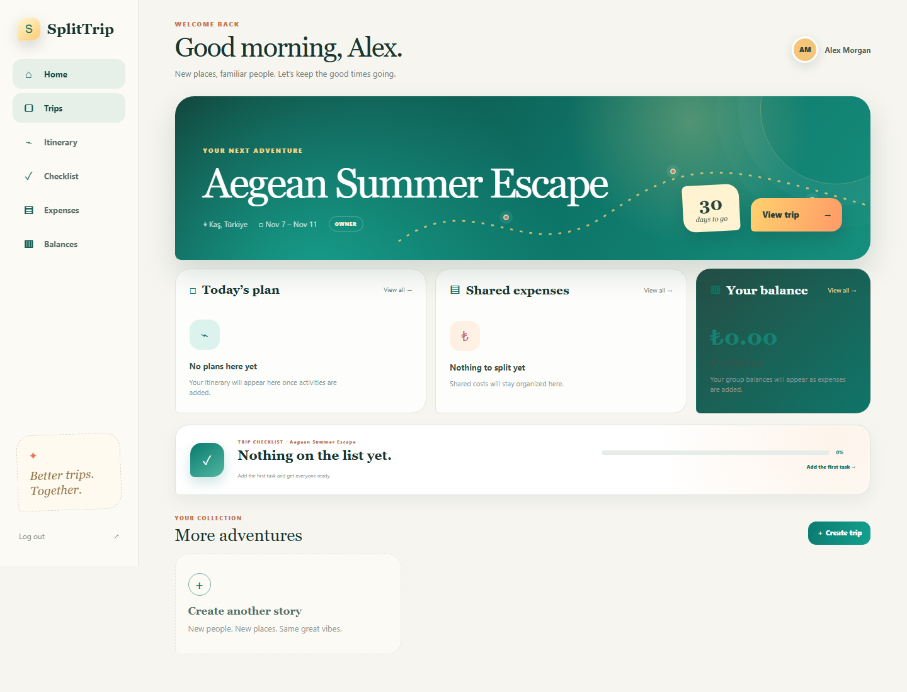
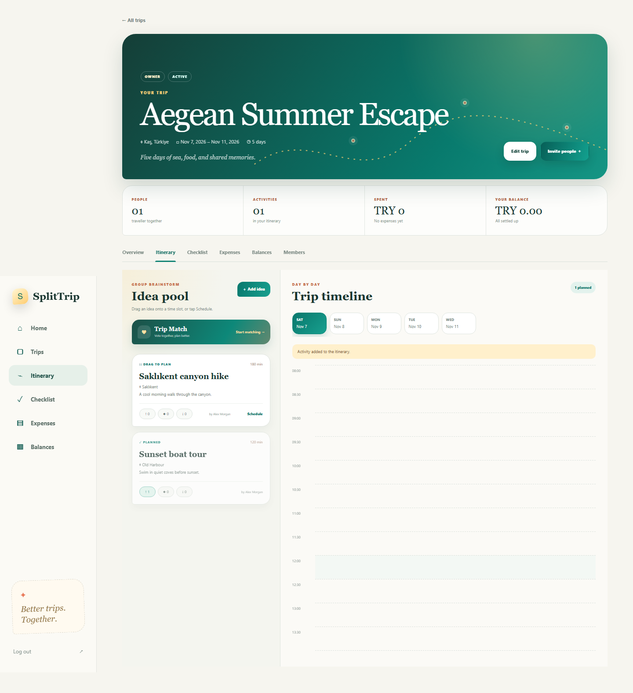
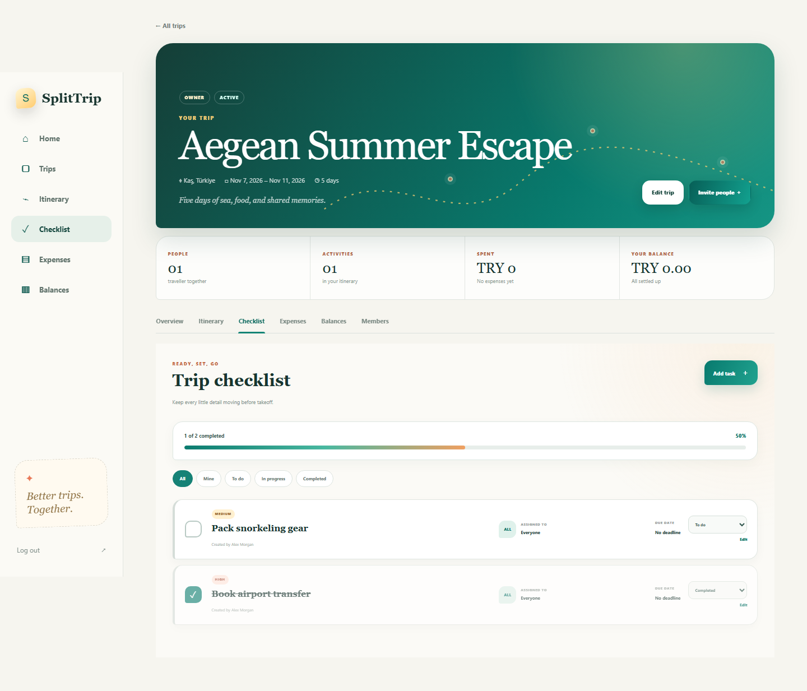
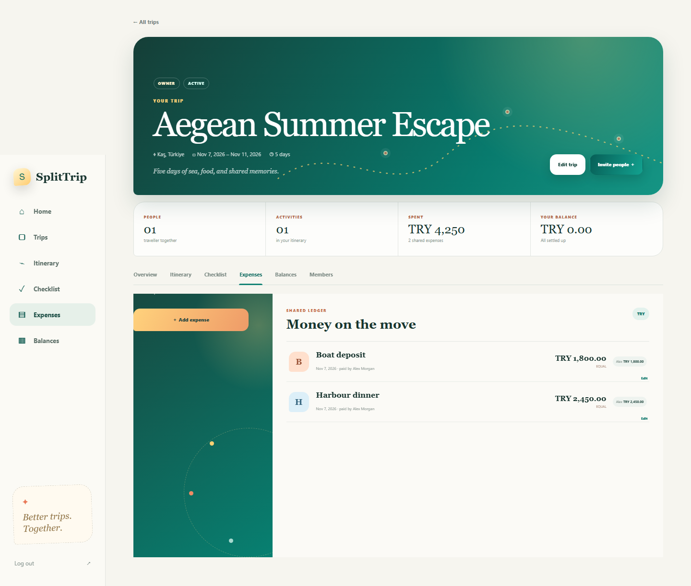
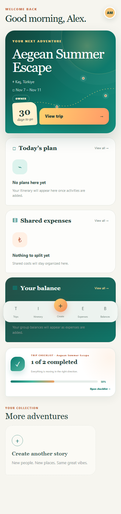
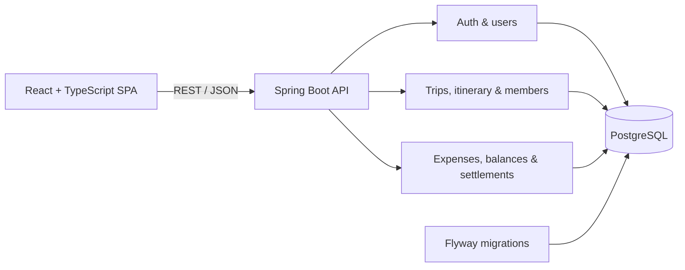

# SplitTrip

[](https://github.com/burakyurduseven/SplitTrip/actions/workflows/ci.yml)


SplitTrip is a mobile-first collaborative travel workspace that turns group ideas into an itinerary and shared spending into clear, auditable balances. Travellers can propose activities, vote together, arrange plans on a visual timeline, coordinate a checklist, split expenses, attach receipts, and settle debts without switching between multiple apps.

> Built as a portfolio project around production-minded full-stack engineering: secure authentication, explicit domain rules, database migrations, integration tests, query optimization, accessibility, and automated delivery checks.



### [▶ Watch the product walkthrough](docs/media/splittrip-demo.webm)

## Product tour

| Collaborative itinerary | Trip checklist |
| --- | --- |
|  |  |
| Shared expense ledger | Mobile-first dashboard |
|  |  |

The complete workspace also includes a [trip overview](docs/media/trip-overview.png) and [balance settlement view](docs/media/balances.png).

## What it does

- Secure account registration, sign-in, rotating refresh sessions, and logout
- Trip creation, member invitations, roles, removal, and voluntary departure
- Unlimited activity ideas with like, maybe, or dislike voting and an optional gamified Trip Match flow
- A visual day planner with drag-and-drop scheduling, time ranges, overlaps, editing, and removal
- Collaborative trip checklists with assignees, priorities, deadlines, and progress tracking
- Expense creation and editing with equal, exact-amount, or percentage splits, plus receipt and invoice attachments
- Per-member balances, simplified suggested repayments, settlement history, and reversible settlements
- A trip overview that combines readiness, itinerary, checklist, expenses, balances, and actionable alerts
- Responsive English interface designed for both phones and desktop browsers

## Architecture



The backend is a **modular monolith**. Features share one deployable application and one PostgreSQL database while package boundaries keep authentication, user, trip, and common concerns separate. The production image serves the compiled React application and the API from the same origin.

See [Architecture](docs/architecture.md) and [Domain model](docs/domain-model.md) for the design in more detail.

## Technology

| Area | Technology |
| --- | --- |
| Backend | Java 21, Spring Boot, Spring Web, Spring Security, Spring Data JPA |
| Frontend | React, TypeScript, Vite, Tailwind CSS |
| Database | PostgreSQL, Flyway |
| API | REST, OpenAPI / Swagger UI |
| Testing | JUnit, Mockito, Testcontainers, Vitest, Testing Library, Playwright |
| Delivery | Docker, GitHub Actions |

## Engineering highlights

- Access tokens are short-lived JWTs; refresh tokens are opaque, hashed in PostgreSQL, rotated on use, and stored in an `HttpOnly` cookie.
- Monetary values use decimal arithmetic and are validated against the trip currency and active membership.
- Balance calculation follows `paid - allocated share + settlements sent - settlements received`; a deterministic greedy pass produces a compact repayment plan.
- Repository queries load related records in batches to avoid N+1 behavior on trip workspaces.
- Flyway owns the schema and Hibernate validates it at startup.
- Integration tests run against a real PostgreSQL container; frontend behavior is covered with user-facing component tests.
- End-to-end tests exercise the complete application against Spring Boot and a real PostgreSQL database in desktop and mobile Chromium viewports.
- CI independently verifies backend tests, frontend lint and component tests, end-to-end browser flows, and the production build.

## Tested user journey

The Playwright suite validates the application as a real traveller would use it:

```text
Register → Log out → Log in → Create trip
    → Propose and vote on an activity → Schedule it
    → Create and complete a checklist task
    → Add, edit, and delete an expense → Review balances
```

The flow runs in both desktop and mobile Chromium viewports. Backend integration tests independently exercise authentication, authorization, invitations, itinerary rules, expense splitting, settlements, attachments, and checklist behavior against PostgreSQL containers.

## Run locally

Prerequisites: Java 21, Node.js 22+, Docker Desktop, and Git.

1. Create the local environment file:

   ```bash
   cp .env.example .env
   ```

2. Start PostgreSQL:

   ```bash
   docker compose up -d postgres
   ```

3. Start the backend:

   ```bash
   cd backend
   ./mvnw spring-boot:run
   ```

4. In another terminal, start the frontend:

   ```bash
   cd frontend
   npm ci
   npm run dev
   ```

Open [http://localhost:5173](http://localhost:5173). Swagger UI is available at [http://localhost:8080/swagger-ui.html](http://localhost:8080/swagger-ui.html).

On Windows PowerShell, use `Copy-Item .env.example .env` and `mvnw.cmd spring-boot:run`.

## Quality checks

```bash
# Backend (Docker must be running for Testcontainers)
cd backend
./mvnw verify

# Frontend
cd frontend
npm run lint
npm test -- --run
npm run build

# End-to-end (PostgreSQL, backend, and frontend must be running)
npm run test:e2e
```

## Production image

The root Dockerfile builds the frontend, embeds it in the Spring Boot application, and creates a non-root Java 21 runtime image.

```bash
docker build -t splittrip .
docker run --rm -p 8080:8080 \
  -v splittrip-data:/app/data \
  -e DB_URL=jdbc:postgresql://host.docker.internal:5432/splittrip \
  -e DB_USERNAME=splittrip \
  -e DB_PASSWORD=splittrip \
  -e JWT_SECRET=replace-with-a-base64-encoded-32-byte-secret \
  -e REFRESH_COOKIE_SECURE=true \
  splittrip
```

For a public deployment, connect the image to a managed PostgreSQL database, set the five environment variables above, and expose port `8080`. The health endpoint is `/actuator/health`.

## Repository layout

```text
backend/    Spring Boot application, migrations, and tests
frontend/   React application and component tests
docs/       Product, domain, and architecture documentation
.github/    Continuous integration workflow
```

## Roadmap

PWA/offline support is intentionally planned for the final stage. Maps, payments, OCR, artificial intelligence, Redis, and WebSockets are outside the current scope so the core collaboration and accounting model stays focused.

## Author

Created by [Burak Yurduseven](https://github.com/burakyurduseven).
