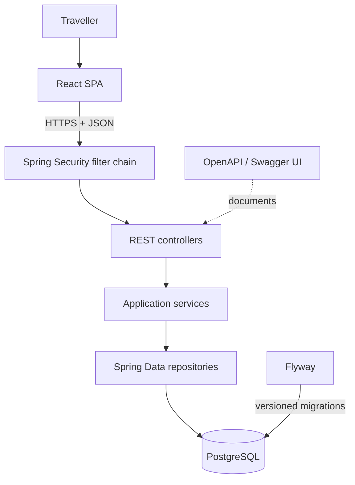

# SplitTrip Architecture

## Overview

SplitTrip is a mobile-first single-page application backed by a modular Spring Boot monolith. The browser and API use the same origin in production. This avoids cross-origin cookie complexity and gives the project one deployable artifact while retaining explicit internal boundaries.



## Backend modules

The Java packages are the module boundaries. Dependencies point from API to application to domain/infrastructure; domain behavior does not depend on the web layer.

```text
com.splittrip
├── auth
│   ├── api              registration, login, refresh, logout
│   ├── application      credential and token workflows
│   ├── domain           refresh-session model
│   └── infrastructure   refresh-session persistence
├── user
│   ├── api              current-user endpoint
│   ├── application      user queries
│   ├── domain           account model
│   └── infrastructure   account persistence
├── trip
│   ├── api              trips, members, ideas, itinerary, expenses, balances, settlements
│   ├── application      authorization and use-case rules
│   ├── domain           aggregate entities and value enums
│   └── infrastructure   feature repositories
├── common
│   ├── api              error mapping and SPA routing
│   └── config           security and OpenAPI configuration
└── status               service status endpoint
```

`trip` is currently one cohesive business module because itinerary and financial operations are always scoped to a trip and share the same membership authorization rules. If those areas grow independently, their package boundaries can be extracted inside the monolith without changing deployment topology.

## Frontend structure

The React application uses page-level components for dashboard, trips, invitations, and trip details. The trip page composes focused itinerary, expense, and balance workspaces. `App.tsx` currently owns session restoration, API coordination, and top-level navigation; splitting those responsibilities into API hooks and a router is the next sensible frontend refactor as the feature set grows.

## Authentication flow

```mermaid
sequenceDiagram
    participant B as Browser
    participant A as API
    participant D as PostgreSQL
    B->>A: POST /auth/login
    A->>D: Verify account; store hashed refresh token
    A-->>B: JWT access token + HttpOnly refresh cookie
    B->>A: API request with Bearer token
    A-->>B: Protected resource
    B->>A: POST /auth/refresh (cookie)
    A->>D: Lock, revoke, and replace refresh session
    A-->>B: New access token + rotated cookie
```

- Access JWTs are signed with HS256 and validate issuer and audience.
- Refresh tokens are random opaque values; only their hashes are persisted.
- Refresh cookies are `HttpOnly`, `SameSite=Strict`, path-scoped to authentication routes, and secure in production.
- Authorization checks are repeated in application services using trip membership and role.

## Financial model

An expense has one payer and one or more immutable share rows after validation. Supported split methods are equal, exact amount, and percentage. Per-member net balance is:

```text
amount paid - allocated expense shares + active settlements sent - active settlements received
```

A positive value means the member should receive money; a negative value means the member owes money. Suggested repayments match debtors to creditors deterministically until all values are within the currency rounding tolerance. Settlements are append-only business records and can be voided, preserving their audit history.

## Persistence and consistency

- PostgreSQL is the source of truth.
- Flyway migrations are applied before Hibernate validates the schema.
- Financial and membership mutations are transactional.
- Pessimistic locking protects refresh-token rotation.
- Batch repository queries prevent N+1 reads when assembling trip workspaces.
- UUIDs are used for public entity identifiers and invitation tokens expire.

## Runtime and delivery

Local development runs Vite and Spring Boot separately; Vite proxies `/api` to port `8080`. The production Docker build compiles the SPA into Spring Boot static resources. Explicit frontend routes forward to `index.html`, while `/api`, Swagger, and actuator routes stay server-owned.

GitHub Actions executes two independent jobs on pushes to `main` and pull requests:

1. Java 21 backend verification, including PostgreSQL Testcontainers integration tests.
2. Node.js 22 frontend lint, component tests, and production build.

The runtime container uses a non-root user and exposes `/actuator/health` for platform health checks.

## Deliberate constraints

- Modular monolith, not microservices
- REST request/response interaction, not WebSockets
- PostgreSQL only; no Redis cache
- No maps, payment processor, OCR, or AI integrations yet
- PWA/offline support deferred until the core product is stable
