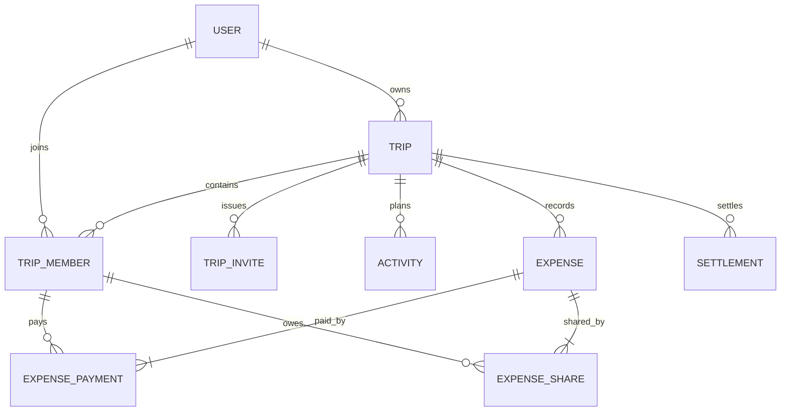

# Başlangıç veri modeli

Bu model kavramsal başlangıç noktasıdır. Tablolar özellik geliştirme aşamalarında ayrı Flyway migration'larıyla eklenecektir.

## Ana varlıklar

### User

- `id`: UUID
- `email`: benzersiz, normalize edilmiş
- `password_hash`
- `display_name`
- `status`: ACTIVE, DELETION_REQUESTED, DELETED
- `created_at`, `updated_at`

### Trip

- `id`: UUID
- `owner_id`: User
- `title`, `description`
- `start_date`, `end_date`
- `default_currency`: ISO 4217 kodu
- `status`: ACTIVE, ARCHIVED
- `created_at`, `updated_at`

### TripMember

- `id`: UUID
- `trip_id`, `user_id`
- `role`: OWNER, MEMBER
- `status`: ACTIVE, LEFT, REMOVED
- `joined_at`, `left_at`

`trip_id + user_id` benzersizdir. Ayrılan üyelerin kaydı finansal geçmiş nedeniyle silinmez.

### TripInvite

- `id`: UUID
- `trip_id`
- `token_hash`: ham token veritabanında saklanmaz
- `created_by`, `expires_at`
- `max_uses`, `use_count`
- `revoked_at`

### Activity

- `id`: UUID
- `trip_id`, `created_by`
- `title`, `description`, `location_text`
- `starts_at`, `ends_at`
- `position`
- `status`: ACTIVE, CANCELLED
- `created_at`, `updated_at`

### Expense

- `id`: UUID
- `trip_id`, `created_by`
- `title`, `description`, `category`
- `amount`: numeric
- `currency`
- `expense_date`
- `split_method`: EQUAL, EXACT, PERCENTAGE
- `status`: ACTIVE, VOIDED
- `version`: optimistic locking
- `created_at`, `updated_at`

### ExpensePayment

Harcamayı gerçekte kimin ne kadar ödediğini tutar.

- `id`: UUID
- `expense_id`, `member_id`
- `amount`: numeric

### ExpenseShare

Harcamadan kimin ne kadar sorumlu olduğunu tutar. Hesaplanmış kesin parasal sonuç burada saklanır.

- `id`: UUID
- `expense_id`, `member_id`
- `amount`: numeric
- `percentage`: yalnızca yüzde yöntemi için giriş/audit bilgisi

### Settlement

Üyeler arasında gerçekten yapılan ödemeyi kaydeder.

- `id`: UUID
- `trip_id`
- `payer_member_id`, `receiver_member_id`
- `amount`, `currency`
- `settled_at`
- `created_by`, `created_at`
- `status`: CONFIRMED, VOIDED

## İlişkiler



## Finansal yaklaşım

Bakiyeler ayrı, değiştirilebilir bir toplam tablosu yerine `ExpensePayment`, `ExpenseShare` ve `Settlement` kayıtlarından hesaplanır. Performans gerektirdiğinde kontrollü bir projection/cache eklenebilir. Böylece başlangıçta doğruluk ve izlenebilirlik korunur.

Bir üyenin net bakiyesi:

```text
toplam ödediği - toplam payı - gönderdiği settlement + aldığı settlement
```

İşaret yorumu API sözleşmesinde kesinleştirilecektir: pozitif değer alacak, negatif değer borç anlamına gelir.
