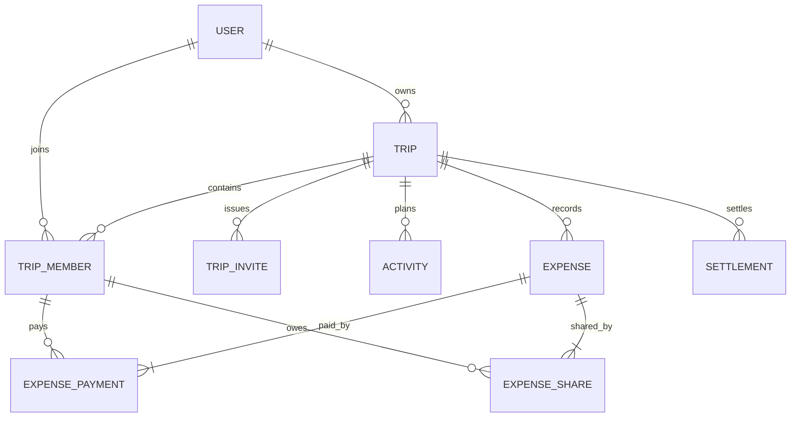

# Initial domain model

This is the conceptual starting point. Tables will be introduced through separate Flyway migrations as each feature is implemented.

## Core entities

### User

- `id`: UUID
- `email`: unique and normalized
- `password_hash`
- `display_name`
- `status`: ACTIVE, DELETION_REQUESTED, DELETED
- `created_at`, `updated_at`

### Trip

- `id`: UUID
- `owner_id`: User
- `title`, `description`
- `start_date`, `end_date`
- `default_currency`: ISO 4217 code
- `status`: ACTIVE, ARCHIVED
- `created_at`, `updated_at`

### TripMember

- `id`: UUID
- `trip_id`, `user_id`
- `role`: OWNER, MEMBER
- `status`: ACTIVE, LEFT, REMOVED
- `joined_at`, `left_at`

The combination of `trip_id` and `user_id` is unique. Membership records are preserved when a user leaves because they may be referenced by financial history.

### TripInvite

- `id`: UUID
- `trip_id`
- `token_hash`: raw tokens are never stored
- `created_by`, `expires_at`
- `max_uses`, `use_count`
- `revoked_at`

### Activity

- `id`: UUID
- `trip_id`, `created_by`
- `title`, `description`, `location_text`
- `starts_at`, `ends_at`
- `position`
- `status`: ACTIVE, CANCELLED
- `created_at`, `updated_at`

### Expense

- `id`: UUID
- `trip_id`, `created_by`
- `title`, `description`, `category`
- `amount`: numeric
- `currency`
- `expense_date`
- `split_method`: EQUAL, EXACT, PERCENTAGE
- `status`: ACTIVE, VOIDED
- `version`: optimistic locking
- `created_at`, `updated_at`

### ExpensePayment

Records who actually paid each part of an expense.

- `id`: UUID
- `expense_id`, `member_id`
- `amount`: numeric

### ExpenseShare

Records the exact monetary responsibility assigned to each member. The calculated monetary result is stored for traceability.

- `id`: UUID
- `expense_id`, `member_id`
- `amount`: numeric
- `percentage`: input and audit information for percentage splits

### Settlement

Records an actual payment between two members.

- `id`: UUID
- `trip_id`
- `payer_member_id`, `receiver_member_id`
- `amount`, `currency`
- `settled_at`
- `created_by`, `created_at`
- `status`: CONFIRMED, VOIDED

## Relationships



## Financial approach

Balances are calculated from `ExpensePayment`, `ExpenseShare`, and `Settlement` records rather than stored as mutable totals. A controlled projection or cache may be introduced later if performance requires it. This keeps correctness and traceability as the initial priorities.

A member's net balance is:

```text
total paid - total share - settlements sent + settlements received
```

The API contract will define the sign convention consistently: a positive value means the member is owed money, and a negative value means the member owes money.
